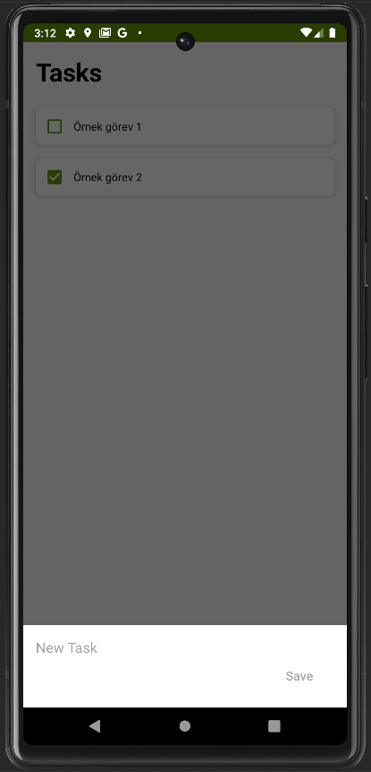

# Do-It!

"This project is an edited version of the project [msindev/Do-It](https://github.com/msindev/Do-It) made with SQLite, but using JSON."

<div style="height:100px">



</div>

```groovy
dependencies {
    implementation 'com.google.android.material:material:1.6.0'
}
```

Dont change to 1.7 or higher.